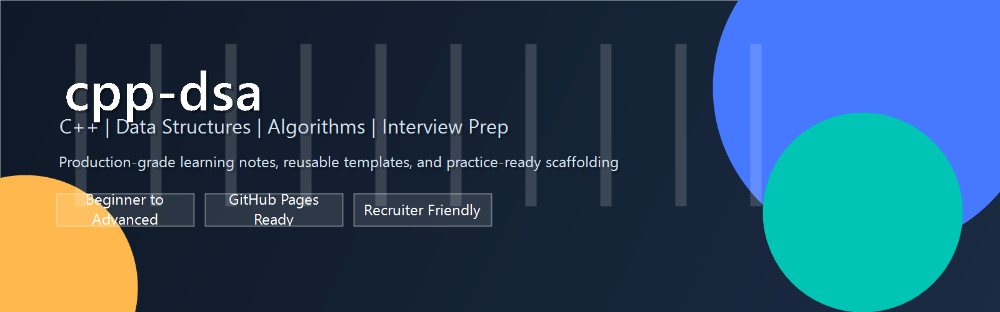

# cpp-dsa

`cpp-dsa` is a production-quality learning repository for modern C++, data structures, algorithms, interview preparation, competitive programming, and coding practice.

The goal is to make one repository that is useful at every stage:

- Beginner friendly explanations
- Clean references for C++ study and revision
- Phase-based documentation for long-term learning
- A structure that can grow into GitHub Pages or MkDocs later

## What You Will Find

- C++ fundamentals and language notes
- Phase-based detailed documentation
- Roadmaps for self-study and revision

## Learning Roadmap

Use the repository in this order for the smoothest learning path:

1. `roadmap/cpp-roadmap.md`
1. `cpp-DETAILED/` for phase-based C++ study notes
1. `assets/` for repository images and visuals

## Repository Map

| Folder | Purpose |
| --- | --- |
| `cpp-DETAILED/` | Phase-based C++ learning notes and documentation |
| `assets/` | Repository images and visual assets |
| `roadmap/` | Learning plans for C++ |

## Tech Stack

- Language: C++17
- Standard Library: STL
- Documentation: Markdown
- Repository hygiene: `.gitignore`, `CONTRIBUTING.md`, `CODE_OF_CONDUCT.md`
- Future publishing options: GitHub Pages, MkDocs, or Docusaurus

## Starter Docs

- [C++ roadmap](roadmap/cpp-roadmap.md)
- [Phase 1 README](cpp-DETAILED/phase-01-fundamentals/README.md)
- [Phase 1 theory](cpp-DETAILED/phase-01-fundamentals/theory.md)
- [Phase 1 roadmap](cpp-DETAILED/phase-01-fundamentals/roadmap.md)

## Folder Philosophy

- Keep each folder focused on one topic
- Prefer short, reusable examples over huge monolithic files
- Add explanations before dumping code
- Use consistent naming so future navigation stays simple
- Store phase notes separately from conceptual notes

## Contribution Guide

We welcome improvements that make the repository easier to learn from.

Before contributing:

- Read [CONTRIBUTING.md](CONTRIBUTING.md)
- Keep examples minimal and correct
- Add comments only where they clarify intent
- Prefer modern C++17 style
- Avoid duplicating content across folders

## License

This project is licensed under the MIT License. See [LICENSE](LICENSE) for details.

## TODO

- Add topic notes under `docs/`
- Add curated problem sets under `problems/`
- Add company-wise interview sheets under `practice/company-wise/`
- Expand templates with additional contest utilities
- Add GitHub Pages configuration when the documentation is ready
