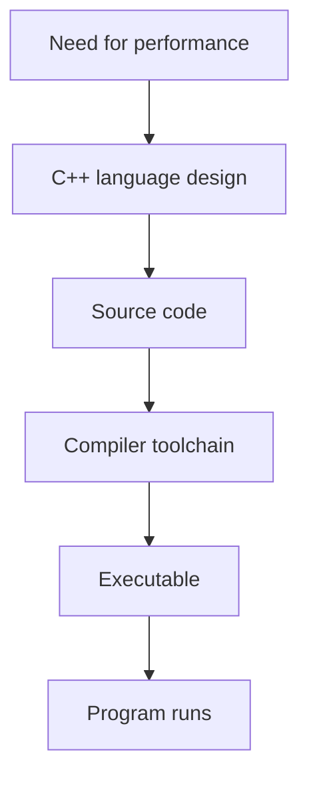
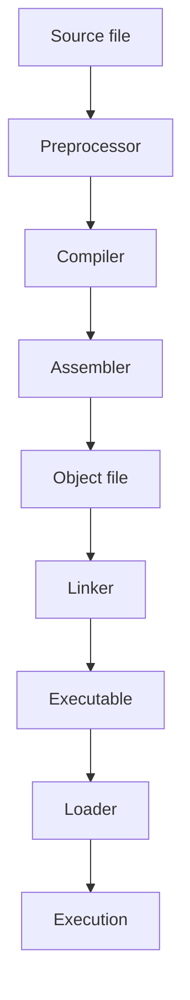
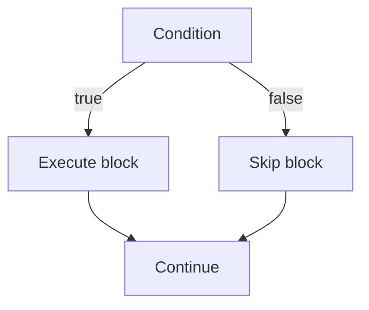
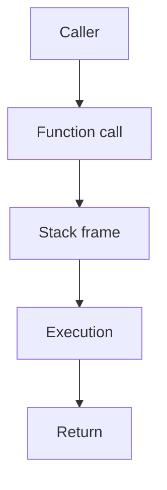

# Phase 1 - Theory

> This chapter is the foundational reference for C++ Fundamentals in `cpp-dsa`.
>
> It is written as a textbook-style guide, not a summary, so the learner can study from first principles and build confidence before moving to arrays, pointers, recursion, OOP, and STL.

## How To Read This Chapter

- Read the chapters in order
- Study the examples and dry runs slowly
- Re-implement the code without looking at the file
- Use the summary and interview notes only after the concept is clear

## Phase 1 Map

| Chapter | Topics Covered |
| --- | --- |
| 1 | Introduction to C++, History, Features, Applications |
| 2 | Compilation Process, Source File, Preprocessor, Compiler, Assembler, Linker, Loader |
| 3 | Variables, Data Types, Literals, Constants, Keywords, Identifiers, Namespaces |
| 4 | Input and Output, Operators, Expressions, Type Conversion |
| 5 | Scope, Lifetime, Storage Classes |
| 6 | Control Flow, `if`, `switch`, Loops, `break`, `continue`, `goto` |
| 7 | Functions, Declaration, Definition, Prototype, Overloading, Inline Functions, Default Arguments, Command-Line Arguments |
| 8 | Basic Debugging, Assertions |

---

# 1. Introduction to C++

## Topics in This Chapter

- Introduction to C++
- History of C++
- Features of C++
- Applications of C++

## 📖 Introduction

### What is it?

C++ is a compiled, general-purpose programming language used to build fast, efficient, and scalable software.

### Why was it introduced?

It was created to combine the performance and control of C with higher-level abstractions such as classes, templates, and generic programming.

### Why is it important?

C++ is used in systems that need speed, predictable behavior, and control over resources.

## 🧠 Intuition

Think of C++ as a professional workshop:

- C gives you sharp tools
- C++ gives you the same tools plus organized drawers, labels, and reusable machine parts

It helps you build things precisely instead of only quickly.

## 📜 Definition

C++ is a statically typed, compiled programming language that supports procedural, object-oriented, and generic programming paradigms.

## 🆚 Comparison Table

| Language Aspect | C++ | C |
| --- | --- | --- |
| Programming style | Multi-paradigm | Mostly procedural |
| Abstraction support | Classes, templates, exceptions | Limited |
| Standard library | Rich STL | Smaller standard library |
| Performance | Very high | Very high |
| Resource control | Strong | Strong |
| Common use | DSA, systems, games, tools | Systems, embedded, low-level code |

## 🎯 Learning Objectives

- Understand what C++ is
- Know why C++ exists
- Learn where C++ is used
- Understand the language's major strengths
- Recognize how C++ evolved over time

## ⚙ Internal Working

C++ code is translated into machine code through a compiler-based toolchain. The source code is checked for syntax and semantic correctness, transformed into object code, linked with libraries, and executed by the machine.

## 📊 Flowchart

```text
Need for performance and control
          |
          v
     C++ language design
          |
          v
  Source code written by programmer
          |
          v
  Toolchain converts code to executable
          |
          v
 Program runs on CPU and memory
```



## 🧩 Memory Representation

C++ programs use memory for:

- stack variables
- heap allocations
- static data
- global data

```text
+---------------------------+
| Stack: local variables    |
+---------------------------+
| Heap: dynamic allocations |
+---------------------------+
| Static/Global data        |
+---------------------------+
```

## 📝 Syntax

There is no special syntax for the concept itself, but the first program usually looks like this:

```cpp
#include <iostream>
using namespace std;

int main() {
    cout << "Hello, C++" << endl;
    return 0;
}
```

## 💻 Multiple Code Examples

### Basic Example

```cpp
#include <iostream>
using namespace std;

int main() {
    cout << "C++ basics" << endl;
    return 0;
}
```

**Output**

```text
C++ basics
```

**Step-by-step**

- `#include <iostream>` enables input/output
- `main()` is the program entry point
- `cout` prints output
- `return 0` ends the program successfully

### Intermediate Example

```cpp
#include <iostream>
using namespace std;

int main() {
    int a = 10, b = 20;
    cout << "Sum = " << a + b << endl;
    return 0;
}
```

**Output**

```text
Sum = 30
```

**Step-by-step**

- Two integers are stored in memory
- The addition happens at runtime
- The result is printed to the console

### Real-World Example

```cpp
#include <iostream>
using namespace std;

int main() {
    double price = 499.50;
    int quantity = 3;
    cout << "Bill = " << price * quantity << endl;
    return 0;
}
```

**Output**

```text
Bill = 1498.5
```

**Step-by-step**

- A billing system stores product price and count
- The total amount is computed
- Output is shown to the user

## ⚡ Dry Run

```text
price = 499.50
quantity = 3
total = price * quantity
total = 1498.5
```

## 📚 Best Practices

- Keep C++ programs readable
- Learn the language gradually
- Prefer standard tools and libraries
- Understand what each feature solves

## ❌ Common Mistakes

- Confusing C with C++
- Ignoring the standard library
- Learning advanced features before basics

## ⚠ Edge Cases

- Old-style C code may still appear in C++ projects
- Some applications mix procedural and object-oriented styles

## 🚀 Real-world Applications

- Game engines
- Browsers
- Financial systems
- Compilers
- Embedded systems

## 🏢 Industry Insight

Software companies use C++ when performance, control, and reliability are more important than convenience.

## 🎤 Interview Notes

### Frequently Asked Questions

- What is C++ used for?
- Why is C++ faster than many interpreted languages?
- What makes C++ different from C?

### Best Answers

- Mention performance, low-level control, and abstraction support

## 📌 Summary

- C++ is fast and flexible
- It supports multiple programming styles
- It is widely used in performance-critical software
- It forms the basis for the rest of the roadmap

---

# 2. Compilation Process and Toolchain

## Topics in This Chapter

- Compilation Process
- Source File
- Preprocessor
- Compiler
- Assembler
- Linker
- Loader

## 📖 Introduction

### What is it?

The compilation process is the pipeline that converts a `.cpp` file into a running program.

### Why was it introduced?

Source code must be transformed into machine-readable instructions that the CPU can execute.

### Why is it important?

Understanding the toolchain helps debug errors and understand how C++ programs are built.

## 🧠 Intuition

Think of writing C++ like writing instructions in a human language. The compiler and linker act like a translation and assembly team that turns your text into a machine-executable product.

## 📜 Definition

Compilation is the process of converting preprocessed source code into object code, then linking object code into an executable.

## 🆚 Stage Comparison

| Stage | Main Job | Output |
| --- | --- | --- |
| Preprocessor | Expands directives | Modified source text |
| Compiler | Checks and translates code | Object code |
| Assembler | Converts to machine-oriented object form | Object file |
| Linker | Combines object files and libraries | Executable |
| Loader | Loads executable into memory | Running program |

## 🎯 Learning Objectives

- Understand every stage of the build pipeline
- Distinguish compiler, linker, and loader errors
- Understand how source files become executables

## ⚙ Internal Working

1. The preprocessor expands directives
2. The compiler checks syntax and generates object code
3. The assembler converts assembly-level output to machine-oriented object code
4. The linker combines object files and libraries
5. The loader places the executable into memory

## 📊 Flowchart

```text
.cpp source file
      |
      v
Preprocessor
      |
      v
Compiler
      |
      v
Assembler
      |
      v
Object file
      |
      v
Linker
      |
      v
Executable
      |
      v
Loader
      |
      v
Memory and CPU execution
```



## 🧩 Memory Representation

```text
Source code is not running yet
        |
        v
Executable is loaded into memory
        |
        v
Code segment + Data segment + Stack + Heap
```

## 📝 Syntax

This topic is about pipeline behavior, so the relevant code is a normal C++ program plus include directives.

```cpp
#include <iostream>
using namespace std;

int main() {
    cout << "Build pipeline" << endl;
    return 0;
}
```

## 💻 Multiple Code Examples

### Basic Example

```cpp
#include <iostream>

int main() {
    return 0;
}
```

**Output**

```text
Program exits successfully
```

**Step-by-step**

- The compiler checks syntax
- The linker creates the executable
- The loader runs the program

### Intermediate Example

```cpp
#include <iostream>
using namespace std;

int main() {
    cout << "Stage 1" << endl;
    cout << "Stage 2" << endl;
    return 0;
}
```

**Output**

```text
Stage 1
Stage 2
```

**Step-by-step**

- Source file is compiled
- Output is linked
- Program executes line by line

### Real-World Example

```cpp
#include <iostream>

int main() {
    std::cout << "A large project may contain many source files" << std::endl;
    return 0;
}
```

**Output**

```text
A large project may contain many source files
```

**Step-by-step**

- Each file can be compiled separately
- The linker joins them into one executable

## ⚡ Dry Run

```text
Source file -> preprocess -> compile -> assemble -> link -> load -> run
```

## 📚 Best Practices

- Learn the difference between build-time stages
- Read compiler and linker messages carefully
- Know which stage produced the error

## ❌ Common Mistakes

- Calling a linker error a compiler error
- Forgetting that preprocessing happens first

## ⚠ Edge Cases

- Some errors appear only at link time
- Header misuse can cause multiple definition problems

## 🚀 Real-world Applications

- Building desktop applications
- Building system software
- Building libraries and game engines

## 🏢 Industry Insight

Teams often use build systems to manage many source files, libraries, and compiler flags efficiently.

## 🎤 Interview Notes

### Frequently Asked Questions

- What happens when you compile a C++ file?
- What is the difference between compilation and linking?
- What does the loader do?

### Best Answers

- Describe the full pipeline in order

## 📌 Summary

- C++ code goes through preprocessing, compilation, assembly, linking, and loading
- Knowing the toolchain helps with debugging
- Each stage has a distinct responsibility

---

# 3. Lexical Elements and Program Building Blocks

## Topics in This Chapter

- Variables
- Data Types
- Literals
- Constants
- Keywords
- Identifiers
- Namespaces

## 📖 Introduction

These are the building blocks used to name, store, and organize information in C++.

## 🧠 Intuition

- Variables are labeled boxes
- Data types define what can go inside the box
- Literals are values written directly
- Constants are locked boxes
- Identifiers are the names on labels
- Namespaces are folders for names

## 📜 Definition

Lexical elements are the basic tokens and naming structures used by the compiler to understand C++ code.

## 🆚 Quick Comparison

| Element | Purpose | Example |
| --- | --- | --- |
| Variable | Stores changing data | `int age = 20;` |
| Constant | Stores fixed data | `const int max = 100;` |
| Literal | Directly written value | `20`, `'A'`, `"Hi"` |
| Keyword | Reserved word | `if`, `return`, `const` |
| Identifier | User-defined name | `age`, `total`, `Math` |
| Namespace | Groups names | `namespace Billing {}` |

## 🎯 Learning Objectives

- Declare and initialize variables
- Use proper types and literals
- Understand reserved keywords and valid identifiers
- Organize code using namespaces

## ⚙ Internal Working

- Variables reserve memory based on type
- Constants may be optimized by the compiler
- Namespaces do not change runtime behavior but improve organization and name resolution

## 📊 Flowchart

```text
Value written in code
        |
        v
Literal chosen
        |
        v
Assigned to variable
        |
        v
Stored in memory using a data type
```

## 🧩 Memory Representation

```text
Stack: local variables
Heap: dynamic objects later in the roadmap
Static: global/static storage
```

## 📝 Syntax

```cpp
const int age = 20;
double price = 99.5;
namespace Math {
    int add(int a, int b) { return a + b; }
}
```

## 💻 Multiple Code Examples

### Basic Example

```cpp
#include <iostream>
using namespace std;

int main() {
    int age = 20;
    cout << age << endl;
    return 0;
}
```

**Output**

```text
20
```

**Step-by-step**

- `int` declares integer storage
- `age` is the identifier
- `20` is the literal

### Intermediate Example

```cpp
#include <iostream>
using namespace std;

int main() {
    const double pi = 3.14159;
    double radius = 2.0;
    cout << pi * radius * radius << endl;
    return 0;
}
```

**Output**

```text
12.5664
```

**Step-by-step**

- `const` makes `pi` immutable
- Radius is stored as a `double`
- Area is computed from values

### Real-World Example

```cpp
#include <iostream>
using namespace std;

namespace Billing {
    const double taxRate = 0.18;
}

int main() {
    double amount = 1000.0;
    cout << amount + amount * Billing::taxRate << endl;
    return 0;
}
```

**Output**

```text
1180
```

**Step-by-step**

- The namespace groups billing-related constants
- The constant tax rate is used in the calculation
- The final amount is printed

## ⚡ Dry Run

```text
amount = 1000
taxRate = 0.18
tax = 180
final = 1180
```

## 📚 Best Practices

- Use meaningful names
- Prefer `const` for fixed values
- Use namespaces for organization

## ❌ Common Mistakes

- Reusing keywords as identifiers
- Using magic numbers instead of constants
- Confusing literals and variables

## ⚠ Edge Cases

- Name shadowing can hide outer variables
- Namespace collisions can occur in large projects

## 🚀 Real-world Applications

- Configuration values
- Billing systems
- Scientific calculations

## 🏢 Industry Insight

Clean naming and constant management improve maintainability across large teams.

## 🎤 Interview Notes

### Frequently Asked Questions

- What is the difference between a variable and a constant?
- What is a namespace?
- What is an identifier?

### Best Answers

- Explain memory storage, naming, and scope clearly

## 📌 Summary

- Variables store values
- Data types define value shape and memory use
- Constants protect values
- Namespaces organize code

---

# 4. Input, Output, Operators, Expressions, and Type Conversion

## Topics in This Chapter

- Input & Output
- Operators
- Expressions
- Type Conversion

## 📖 Introduction

These topics let programs receive data, process it, and produce meaningful output.

## 🧠 Intuition

- Input is reading data from the user
- Output is talking back to the user
- Operators are tools for doing work
- Expressions combine tools and values into a result
- Type conversion is translating between formats

## 📜 Definition

This chapter covers interaction with streams, performing operations on values, and converting values between types.

## 🎯 Learning Objectives

- Read and print values
- Use arithmetic and relational operators
- Understand expressions
- Perform safe type conversion

## 🆚 Comparison Table

| Concept | What It Does | Example |
| --- | --- | --- |
| Input | Reads data | `cin >> x;` |
| Output | Displays data | `cout << x;` |
| Operator | Performs action | `+`, `>`, `&&` |
| Expression | Combines values and operators | `a + b * c` |
| Type conversion | Changes data type | `static_cast<int>(x)` |

## ⚙ Internal Working

- `cin` reads from standard input
- `cout` writes to standard output
- Operators are evaluated according to precedence
- Type conversions may happen automatically or explicitly

## 📊 Flowchart

```text
User input
    |
    v
Program reads values
    |
    v
Operators process values
    |
    v
Expression result
    |
    v
Program prints output
```

## 🧩 Memory Representation

Values read from input are stored in variables on stack or other appropriate storage, depending on how they are declared.

## 📝 Syntax

```cpp
int x;
cin >> x;
cout << x << endl;
```

## 💻 Multiple Code Examples

### Basic Example

```cpp
#include <iostream>
using namespace std;

int main() {
    int a = 5, b = 7;
    cout << a + b << endl;
    return 0;
}
```

**Output**

```text
12
```

### Intermediate Example

```cpp
#include <iostream>
using namespace std;

int main() {
    int age;
    cin >> age;
    cout << "Age = " << age << endl;
    return 0;
}
```

**Output**

```text
Age = 21
```

### Real-World Example

```cpp
#include <iostream>
using namespace std;

int main() {
    double price = 49.99;
    int quantity = 3;
    cout << "Total = " << price * quantity << endl;
    return 0;
}
```

**Output**

```text
Total = 149.97
```

## ⚡ Dry Run

```text
price = 49.99
quantity = 3
result = 149.97
```

## 📚 Best Practices

- Use the correct input method for the task
- Understand operator precedence
- Use explicit casts when needed

## ❌ Common Mistakes

- Confusing `=` with `==`
- Forgetting that `cin >>` stops at whitespace
- Losing precision during conversion

## ⚠ Edge Cases

- Division by zero
- Narrowing conversions
- Input buffering issues with `getline`

## 🚀 Real-world Applications

- Billing
- Data entry
- Validation
- Sensor processing

## 🏢 Industry Insight

Input/output and expression handling form the core of many user-facing and data-processing applications.

## 🎤 Interview Notes

### Frequently Asked Questions

- What is the difference between `cin` and `getline`?
- What are operators?
- What is type conversion?

### Best Answers

- Explain stream behavior and conversion safety

## 📌 Summary

- Input reads data
- Output displays data
- Operators compute or compare
- Expressions produce results
- Type conversion changes representation

---

# 5. Scope, Lifetime, and Storage Classes

## Topics in This Chapter

- Scope
- Lifetime
- Storage Classes

## 📖 Introduction

These concepts explain where names are visible, how long values exist, and how storage is managed.

## 🧠 Intuition

- Scope is where a name can be seen
- Lifetime is how long it exists
- Storage class is how it is stored

## 📜 Definition

Scope defines accessibility, lifetime defines duration of existence, and storage classes describe storage duration and linkage behavior.

## 🎯 Learning Objectives

- Understand when variables can be used
- Understand how long objects live
- Distinguish scope from lifetime

## 🆚 Comparison Table

| Concept | Meaning | Example |
| --- | --- | --- |
| Scope | Where a name is accessible | Inside a block |
| Lifetime | How long an object exists | Until block ends |
| Storage class | How storage is managed | `static` variable |

## ⚙ Internal Working

- Local variables usually live on the stack
- Static variables persist across the program
- Global variables exist for the entire program run

## 📊 Flowchart

```text
Variable declared
      |
      v
Scope begins
      |
      v
Variable used
      |
      v
Scope ends or program ends
      |
      v
Lifetime ends
```

## 🧩 Memory Representation

```text
+----------------------+
| Stack: local values  |
+----------------------+
| Heap: dynamic later  |
+----------------------+
| Static/global values |
+----------------------+
```

## 📝 Syntax

```cpp
int globalValue = 10;

int main() {
    static int count = 0;
    int localValue = 5;
    return 0;
}
```

## 💻 Multiple Code Examples

### Basic Example

```cpp
#include <iostream>
using namespace std;

int main() {
    int x = 10;
    {
        int y = 20;
        cout << x + y << endl;
    }
    return 0;
}
```

**Output**

```text
30
```

### Intermediate Example

```cpp
#include <iostream>
using namespace std;

int main() {
    for (int i = 0; i < 3; i++) {
        cout << i << " ";
    }
    return 0;
}
```

**Output**

```text
0 1 2
```

### Real-World Example

```cpp
#include <iostream>
using namespace std;

int counter = 0;

void increment() {
    static int calls = 0;
    calls++;
    counter++;
    cout << calls << " " << counter << endl;
}

int main() {
    increment();
    increment();
    return 0;
}
```

**Output**

```text
1 1
2 2
```

## ⚡ Dry Run

```text
counter = 0
calls = 0
increment()
calls = 1, counter = 1
increment()
calls = 2, counter = 2
```

## 📚 Best Practices

- Minimize scope
- Prefer local variables where possible
- Understand static storage carefully

## ❌ Common Mistakes

- Confusing scope with lifetime
- Using globals unnecessarily
- Returning references to local variables

## ⚠ Edge Cases

- Loop variables disappear after loop scope ends
- Static objects retain state across calls

## 🚀 Real-world Applications

- Counters
- Caches
- Configuration values

## 🏢 Industry Insight

Scope and lifetime rules help teams avoid bugs in large codebases and resource management logic.

## 🎤 Interview Notes

### Frequently Asked Questions

- What is the difference between scope and lifetime?
- What is a static variable?
- Why is global state discouraged?

### Best Answers

- Distinguish visibility from duration and mention maintainability

## 📌 Summary

- Scope controls visibility
- Lifetime controls existence
- Storage classes describe persistence behavior

---

# 6. Control Flow

## Topics in This Chapter

- Control Flow
- `if`
- `switch`
- Loops
- `break`
- `continue`
- `goto`

## 📖 Introduction

Control flow decides which statements execute and in what order.

## 🧠 Intuition

Think of control flow as road signs:

- `if` chooses a road
- `switch` chooses from several roads
- loops repeat a road
- `break` exits the road
- `continue` skips a checkpoint

## 📜 Definition

Control flow statements alter the normal sequential execution of a program.

## 🎯 Learning Objectives

- Write conditional programs
- Use loops effectively
- Understand loop control statements

## 🆚 Control Flow Comparison

| Statement | Best For | Notes |
| --- | --- | --- |
| `if` | Single or nested conditions | Flexible branching |
| `switch` | Fixed discrete choices | Needs `break` usually |
| `for` | Known iteration count | Compact and readable |
| `while` | Condition-based repetition | Good when count is unknown |
| `do-while` | Must run at least once | Checks condition after body |

## ⚙ Internal Working

The CPU executes one statement after another, but control flow statements change the next instruction path based on conditions or loop counters.

## 📊 Flowchart

```text
Condition?
   / \
  yes no
  |    |
  v    v
Block A Block B
   \   /
    v v
 Continue program
```



## 🧩 Memory Representation

Control flow itself does not store data, but the variables it uses may live on stack, heap, or static memory.

## 📝 Syntax

```cpp
if (score >= 50) {
    cout << "Pass";
}
```

## 💻 Multiple Code Examples

### Basic Example

```cpp
#include <iostream>
using namespace std;

int main() {
    int x = 5;
    if (x > 0) {
        cout << "Positive" << endl;
    }
    return 0;
}
```

**Output**

```text
Positive
```

### Intermediate Example

```cpp
#include <iostream>
using namespace std;

int main() {
    int day = 3;
    switch (day) {
        case 1: cout << "Mon"; break;
        case 2: cout << "Tue"; break;
        case 3: cout << "Wed"; break;
        default: cout << "Other";
    }
    return 0;
}
```

**Output**

```text
Wed
```

### Real-World Example

```cpp
#include <iostream>
using namespace std;

int main() {
    for (int i = 1; i <= 5; i++) {
        if (i == 3) continue;
        cout << i << " ";
    }
    return 0;
}
```

**Output**

```text
1 2 4 5
```

## ⚡ Dry Run

```text
i = 1 -> print
i = 2 -> print
i = 3 -> continue
i = 4 -> print
i = 5 -> print
```

## 📚 Best Practices

- Prefer clear branching
- Use `switch` for fixed choices
- Keep loops readable

## ❌ Common Mistakes

- Missing `break` in `switch`
- Infinite loops
- Off-by-one errors
- Using `goto` casually

## ⚠ Edge Cases

- Empty loop ranges
- Conditions that never become false
- Nested branching complexity

## 🚀 Real-world Applications

- Menu systems
- Validation logic
- Search and filtering

## 🏢 Industry Insight

Control flow is central to almost every business rule and application workflow.

## 🎤 Interview Notes

### Frequently Asked Questions

- What is the difference between `if` and `switch`?
- What is the use of `break`?
- What does `continue` do?

### Best Answers

- Explain execution order and readability tradeoffs

## 📌 Summary

- `if` handles conditions
- `switch` handles discrete choices
- loops handle repetition
- `break` and `continue` control loop behavior

---

# 7. Functions

## Topics in This Chapter

- Functions
- Function Declaration
- Function Definition
- Function Prototype
- Function Overloading
- Inline Functions
- Default Arguments
- Command Line Arguments

## 📖 Introduction

Functions let you package logic into reusable units.

## 🧠 Intuition

Think of a function like a vending machine:

- you give it input
- it does work internally
- it returns a result

## 📜 Definition

A function is a named block of code that can accept parameters, perform a task, and optionally return a value.

## 🎯 Learning Objectives

- Write reusable code
- Separate interface from implementation
- Understand parameters and return values
- Use overloading and defaults

## 🆚 Function Concepts Table

| Concept | Meaning | Why It Matters |
| --- | --- | --- |
| Declaration | Tells compiler the function exists | Enables early checking |
| Definition | Provides the function body | Contains actual logic |
| Prototype | Declaration before use | Helps organize code |
| Overloading | Same name, different parameters | Improves readability |
| Inline function | Suggests call replacement | Useful for small functions |
| Default argument | Fallback parameter value | Reduces repeated arguments |

## ⚙ Internal Working

When a function is called:

- arguments are passed
- a stack frame is created
- local variables are stored
- code executes
- control returns to the caller

## 📊 Flowchart

```text
Caller
  |
  v
Function call
  |
  v
Stack frame created
  |
  v
Function executes
  |
  v
Return value sent back
```



## 🧩 Memory Representation

```text
Stack
  - function parameters
  - local variables
  - return information
```

## 📝 Syntax

```cpp
int add(int a, int b) {
    return a + b;
}
```

## 💻 Multiple Code Examples

### Basic Example

```cpp
#include <iostream>
using namespace std;

int add(int a, int b) {
    return a + b;
}

int main() {
    cout << add(2, 3) << endl;
    return 0;
}
```

**Output**

```text
5
```

### Intermediate Example

```cpp
#include <iostream>
using namespace std;

int power(int base, int exp = 2) {
    int result = 1;
    for (int i = 0; i < exp; i++) result *= base;
    return result;
}

int main() {
    cout << power(3) << endl;
    cout << power(3, 4) << endl;
    return 0;
}
```

**Output**

```text
9
81
```

### Real-World Example

```cpp
#include <iostream>
using namespace std;

void printBill(double amount, double tax = 0.18) {
    cout << amount + amount * tax << endl;
}

int main() {
    printBill(1000);
    return 0;
}
```

**Output**

```text
1180
```

## ⚡ Dry Run

```text
add(2, 3)
parameters: a=2, b=3
result = 5
return to caller
```

## 📚 Best Practices

- Keep functions focused
- Use clear parameter names
- Return values when appropriate
- Prefer prototypes for larger files

## ❌ Common Mistakes

- Forgetting return statements
- Writing functions that do too much
- Using overloading carelessly

## ⚠ Edge Cases

- Default arguments can create ambiguity
- Recursive functions need a clear base case

## 🚀 Real-world Applications

- Mathematical utilities
- Billing calculations
- Validation functions
- Reusable library code

## 🏢 Industry Insight

Functions are the core unit of reuse in both small scripts and large systems.

## 🎤 Interview Notes

### Frequently Asked Questions

- What is the difference between declaration and definition?
- What is a prototype?
- What is function overloading?

### Best Answers

- Explain interface, implementation, and reuse

## 📌 Summary

- Functions improve modularity
- Declarations tell the compiler a function exists
- Definitions provide logic
- Overloading and defaults improve usability

---

# 8. Basic Debugging and Assertions

## Topics in This Chapter

- Basic Debugging
- Assertions

## 📖 Introduction

Debugging is the process of finding and fixing problems in a program. Assertions help verify assumptions while debugging.

## 🧠 Intuition

- Debugging is detective work
- Assertions are alarms that ring when something impossible happens

## 📜 Definition

Debugging is the systematic process of identifying the cause of errors. An assertion is a runtime check used to validate a program assumption.

## 🎯 Learning Objectives

- Read compiler messages
- Trace program state
- Find logic mistakes
- Use assertions for internal checks

## 🆚 Debugging vs Assertions

| Tool | Purpose | When to Use |
| --- | --- | --- |
| Debugging | Find the cause of bugs | During investigation |
| Assertions | Verify assumptions | During development and testing |

## ⚙ Internal Working

Debugger tools or manual tracing help inspect variables, call flow, and program state. Assertions stop the program when a condition expected to always be true is false.

## 📊 Flowchart

```text
Program runs
    |
    v
Unexpected behavior
    |
    v
Trace inputs and variables
    |
    v
Find root cause
    |
    v
Fix and retest
```

## 🧩 Memory Representation

Debugging often involves checking:

- stack values
- local variables
- function return values
- control flow state

## 📝 Syntax

```cpp
#include <cassert>
assert(x > 0);
```

## 💻 Multiple Code Examples

### Basic Example

```cpp
#include <iostream>
using namespace std;

int main() {
    int x = 5;
    cout << x << endl;
    return 0;
}
```

**Output**

```text
5
```

### Intermediate Example

```cpp
#include <iostream>
#include <cassert>
using namespace std;

int main() {
    int age = 18;
    assert(age >= 0);
    cout << "Valid age" << endl;
    return 0;
}
```

**Output**

```text
Valid age
```

### Real-World Example

```cpp
#include <iostream>
using namespace std;

int main() {
    int total = 10;
    int items = 2;
    if (items == 0) {
        cout << "Invalid input" << endl;
        return 0;
    }
    cout << total / items << endl;
    return 0;
}
```

**Output**

```text
5
```

## ⚡ Dry Run

```text
items = 2
total = 10
total / items = 5
```

## 📚 Best Practices

- Trace small examples first
- Use assertions for invariants
- Fix one issue at a time

## ❌ Common Mistakes

- Ignoring compiler warnings
- Guessing instead of tracing
- Using assertions as user-facing validation

## ⚠ Edge Cases

- Division by zero
- Invalid input
- Negative values where only positive values are valid

## 🚀 Real-world Applications

- Application validation
- Defensive programming
- Testing and verification

## 🏢 Industry Insight

Professional developers use debugging tools, logs, assertions, and careful tracing to diagnose issues efficiently.

## 🎤 Interview Notes

### Frequently Asked Questions

- How do you debug a program?
- What is an assertion?
- When should assertions be used?

### Best Answers

- Mention compiler messages, tracing, test cases, and invariant checking

## 📌 Summary

- Debugging finds problems
- Assertions verify assumptions
- Both improve correctness and maintainability

---

# Final Revision Table

| Concept | Quick Revision |
| --- | --- |
| C++ | Fast, compiled, multi-paradigm language |
| Compilation | Source -> preprocess -> compile -> assemble -> link -> load |
| Variables | Named storage locations |
| Types | Define value kind and memory use |
| Constants | Immutable values |
| Namespace | Name organization and conflict prevention |
| Input/Output | Stream-based interaction |
| Operators | Perform computations and comparisons |
| Scope | Where a name is accessible |
| Lifetime | How long an object exists |
| Control Flow | Decision making and repetition |
| Functions | Reusable logic blocks |
| Debugging | Find and fix errors systematically |

## Key Takeaways

- Master the toolchain before moving to advanced topics
- Use variables, types, and control flow confidently
- Understand functions, scope, and lifetime early
- Debug carefully and use assertions wisely

## Revision Notes

- Revisit examples without looking at the explanations
- Practice dry runs on paper
- Explain each chapter aloud to test understanding

## Quick Facts

- C++ is compiled
- `main()` is the entry point
- Variables store data
- Functions reuse logic
- Scope and lifetime are not the same
- `break` and `continue` control loops
- Assertions catch invalid assumptions during development
