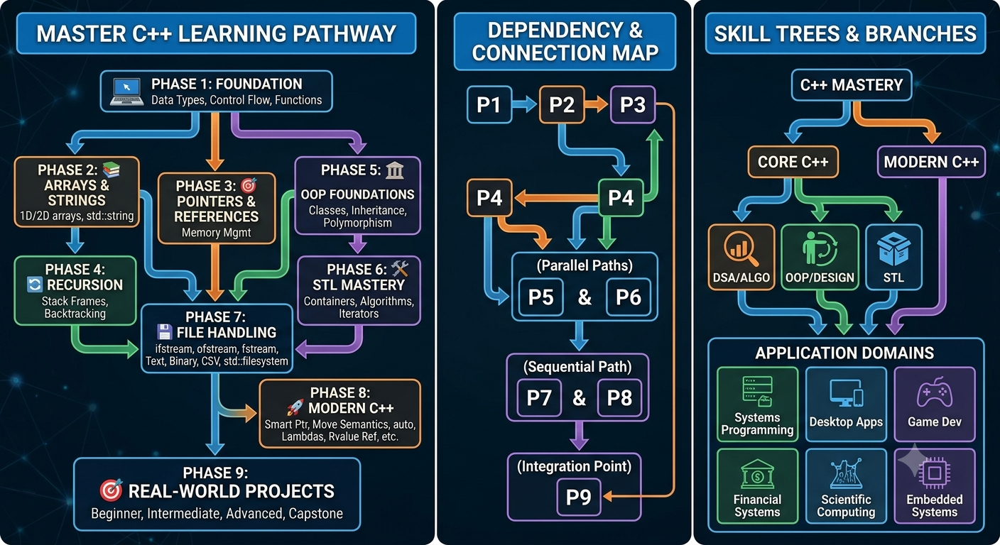

# C++ Learning Roadmap



This roadmap is designed for learners preparing for DSA, competitive programming, GATE, software engineering interviews, and real-world C++ development.

Use it as a curriculum, a revision checklist, and a reference map for building strong C++ problem-solving skill.

## Roadmap At A Glance

| Phase | Focus | Outcome |
| --- | --- | --- |
| Phase 1 | Fundamentals | Read, compile, and write core C++ confidently |
| Phase 2 | Arrays and Strings | Solve the most common beginner DSA problems |
| Phase 3 | Pointers and References | Understand memory, indirection, and parameter passing |
| Phase 4 | Recursion | Build the base for backtracking and tree thinking |
| Phase 5 | OOP | Design clean, reusable, and maintainable classes |
| Phase 6 | STL | Solve problems faster with the standard library |
| Phase 7 | File Handling | Persist and process data safely |
| Phase 8 | Modern C++ | Write safer, cleaner, and more expressive code |
| Phase 9 | Projects | Combine everything into portfolio-ready applications |

## How To Use This Roadmap

- Follow the phases in order because later phases depend on earlier ones
- Treat each phase as a mastery checkpoint, not a time box
- Solve problems immediately after learning a concept
- Build small programs before moving to the next topic
- Revisit the interview concepts section before mock interviews
- Use the project phase to integrate multiple concepts into one codebase

## Detailed Phase Guides

- Phase 1: `../cpp-DETAILED/phase-01-fundamentals/`
- Phase 2: `../cpp-DETAILED/phase-02-arrays-and-strings/`
- Phase 3: `../cpp-DETAILED/phase-03-pointers-and-references/`
- Phase 4: `../cpp-DETAILED/phase-04-recursion/`
- Phase 5: `../cpp-DETAILED/phase-05-oop/`
- Phase 6: `../cpp-DETAILED/phase-06-stl/`
- Phase 7: `../cpp-DETAILED/phase-07-file-handling/`
- Phase 8: `../cpp-DETAILED/phase-08-modern-cpp/`
- Phase 9: `../cpp-DETAILED/phase-09-projects/`

## Phase 1: C++ Fundamentals

### Learning Objectives

- Understand how C++ programs are written, compiled, linked, and executed
- Build a strong base in syntax, data types, control flow, and functions
- Learn how scope, lifetime, constants, and type conversion affect correctness
- Write small programs confidently without relying on advanced abstractions

### Topics Covered

- Introduction to C++
- Compilation process
- Preprocessor basics
- Variables and data types
- Input and output
- Operators
- Control flow
- Loops
- Functions
- Function prototypes
- Scope and lifetime
- Storage duration basics
- Type casting
- Constants
- Namespaces
- Basic error handling with return values

### Recommended Practice

- Write small programs for each syntax concept
- Solve arithmetic, condition-based, and loop-based problems
- Practice writing input-driven programs from scratch
- Recreate simple calculator, grading, and pattern-printing programs

### Mini Projects

- Basic calculator
- Student marks calculator
- Grade evaluator
- Number properties checker
- Menu-driven utility program

### Common Mistakes

- Confusing assignment with comparison
- Ignoring integer division behavior
- Using global variables unnecessarily
- Misunderstanding scope and variable shadowing
- Overusing `using namespace std;` in larger programs
- Mixing `cin` and `getline` without understanding buffer behavior

### Interview-Relevant Concepts

- Compilation, linking, and execution flow
- Data types and type conversion
- Scope, lifetime, and storage duration
- Pass-by-value basics
- `const` correctness
- `namespace` usage

---

## Phase 2: Arrays and Strings

### Learning Objectives

- Manipulate contiguous data efficiently
- Solve beginner-level array and string problems
- Build fluency with indexing, traversal, and basic searching
- Prepare for problem-solving patterns used in DSA and CP

### Topics Covered

- 1D arrays
- 2D arrays
- Character arrays
- C-style strings
- `std::string`
- String input handling
- String methods and traversal
- Basic searching
- Frequency counting
- Pattern problems
- Common array and string edge cases

### Recommended Practice

- Traverse arrays forward and backward
- Compute min, max, sum, average, and frequency
- Reverse arrays and strings
- Check palindromes
- Solve pattern-printing exercises
- Practice linear search and simple string matching

### Mini Projects

- Array statistics analyzer
- String utility toolkit
- Pattern printer
- Palindrome and anagram checker

### Common Mistakes

- Off-by-one errors
- Out-of-bounds access
- Incorrect handling of spaces in strings
- Confusing `char[]` with `std::string`
- Modifying strings without checking length
- Forgetting that 2D arrays are row-major in memory

### Interview-Relevant Concepts

- Array traversal and indexing
- Time complexity of linear scan
- String manipulation basics
- Difference between char arrays and `std::string`
- Pattern-based problem solving

---

## Phase 3: Pointers and References

### Learning Objectives

- Understand how memory addresses and indirection work
- Learn how references simplify safe parameter passing
- Build intuition for dynamic memory and memory layout
- Prepare for linked structures, trees, and advanced C++ code

### Topics Covered

- Pointer basics
- Address operator and dereference operator
- Pointer arithmetic
- Null pointers and safety
- References
- Double pointers
- Pointers with arrays and strings
- Dynamic memory allocation
- `new` and `delete`
- Array allocation and deallocation
- Memory layout
- Stack vs heap
- Pass by value vs pass by reference vs pass by pointer

### Recommended Practice

- Write swap functions using pointers and references
- Practice pointer traversal of arrays
- Allocate and release dynamic arrays
- Simulate matrix allocation with pointers
- Trace memory addresses while debugging small examples

### Mini Projects

- Dynamic array manager
- Pointer-based swap utility
- Matrix allocator
- Address tracing demo

### Common Mistakes

- Using dangling pointers
- Memory leaks
- Double deletion
- Returning addresses of local variables
- Confusing pointer-to-pointer semantics
- Incorrect pointer arithmetic

### Interview-Relevant Concepts

- Pointer vs reference
- Heap vs stack
- Dangling pointer and null pointer
- Dynamic memory allocation
- Memory leak prevention

---

## Phase 4: Recursion

### Learning Objectives

- Think recursively and identify subproblems
- Understand stack frames and function call behavior
- Prepare for backtracking, trees, divide and conquer, and DP

### Topics Covered

- Recursive thinking
- Base case
- Recursive case
- Stack frames
- Call stack growth
- Head recursion
- Tail recursion
- Indirect recursion
- Recursion tracing
- Backtracking introduction

### Recommended Practice

- Factorial, Fibonacci, and power functions
- Recursively print sequences and patterns
- Generate subsets and permutations
- Practice recursion tracing on paper
- Solve backtracking warm-up problems

### Mini Projects

- Recursive math toolkit
- Directory-style tree printer
- Subset generator
- Permutation generator

### Common Mistakes

- Missing or weak base cases
- Repeated recomputation
- Stack overflow due to deep recursion
- Not understanding return order
- Using recursion where iteration is simpler

### Interview-Relevant Concepts

- Base case and termination
- Stack frame behavior
- Recursive decomposition
- Backtracking basics
- Time complexity of recursion

---

## Phase 5: Object-Oriented Programming

### Learning Objectives

- Model real-world entities using classes
- Learn encapsulation, inheritance, and polymorphism
- Understand resource management and object lifetime
- Write maintainable code with proper abstractions

### Topics Covered

- Classes and objects
- Constructors
- Destructors
- Access specifiers
- Encapsulation
- Abstraction
- Inheritance
- Types of inheritance
- Polymorphism
- Compile-time and run-time polymorphism
- Virtual functions
- Pure virtual functions
- Abstract classes
- Friend functions
- Static members
- `this` pointer
- Function overloading
- Operator overloading
- Exception handling
- Copy constructor
- Copy assignment operator
- Rule of 3, Rule of 5, Rule of 0

### Recommended Practice

- Build class-based models from everyday examples
- Practice constructors, destructors, and member functions
- Implement inheritance hierarchies carefully
- Overload operators for meaningful value types
- Write exception-safe classes with proper ownership

### Mini Projects

- Student management model
- Bank account system
- Library management model
- Shape hierarchy with area calculation
- Complex number class

### Common Mistakes

- Breaking encapsulation by exposing data
- Forgetting virtual destructors in base classes
- Slicing objects when passing by value
- Overusing inheritance when composition is better
- Writing unsafe copy logic
- Forgetting const member functions

### Interview-Relevant Concepts

- Encapsulation vs abstraction
- Inheritance vs composition
- Virtual dispatch and polymorphism
- Constructor and destructor order
- Copy control and object lifetime
- Exception safety

---

## Phase 6: Standard Template Library (STL)

### Learning Objectives

- Use STL containers and algorithms effectively
- Choose the right container for each problem
- Write shorter, safer, and faster solutions in contests and interviews

### Topics Covered

- Containers
- Iterators
- Algorithms
- Function objects
- Lambdas
- `pair`
- `tuple`
- `vector`
- `array`
- `list`
- `deque`
- `stack`
- `queue`
- `priority_queue`
- `set`
- `multiset`
- `unordered_set`
- `map`
- `multimap`
- `unordered_map`
- `bitset`
- Common iterator categories
- Custom comparators
- Sorting and searching algorithms

### Recommended Practice

- Reimplement common operations with STL
- Use each container in a matching problem type
- Solve sorting, frequency, and order-statistics problems
- Practice custom comparators and lambda captures
- Learn algorithm complexity for each standard utility

### Mini Projects

- Contest template with STL utilities
- Frequency analyzer using maps and sets
- Custom sorting demo
- Sliding-window helper toolkit

### Common Mistakes

- Using the wrong container for the access pattern
- Assuming unordered containers preserve order
- Forgetting iterator invalidation rules
- Misusing `priority_queue` comparators
- Overlooking `set` and `map` logarithmic complexity
- Copying large containers unnecessarily

### Interview-Relevant Concepts

- Container selection tradeoffs
- Iterator invalidation
- Sorting and searching with STL
- Hash-based vs tree-based containers
- Time complexity of standard algorithms

---

## Phase 7: File Handling

### Learning Objectives

- Read and write persistent data safely
- Understand file streams and basic serialization
- Handle structured and unstructured text data

### Topics Covered

- `ifstream`
- `ofstream`
- `fstream`
- File modes
- Text files
- Binary files
- CSV handling
- Sequential file processing
- Stream state checking
- Basic serialization and deserialization

### Recommended Practice

- Read a text file line by line
- Write formatted output to a report file
- Parse CSV-like rows
- Build small utilities that transform file contents

### Mini Projects

- File-based notes app
- Log analyzer
- CSV student record reader
- Simple backup or export tool

### Common Mistakes

- Not checking whether a file opened successfully
- Forgetting to close streams when needed
- Mixing formatted and unformatted input carelessly
- Mishandling delimiters in CSV data
- Treating binary and text files the same way

### Interview-Relevant Concepts

- File stream classes
- Text vs binary handling
- Error checking with file I/O
- Basic data persistence strategies

---

## Phase 8: Modern C++

### Learning Objectives

- Write expressive and efficient modern C++ code
- Reduce raw-pointer usage and manual resource management
- Use language features that improve clarity and performance

### Topics Covered

- `auto`
- `nullptr`
- Range-based loops
- Smart pointers
- `unique_ptr`
- `shared_ptr`
- `weak_ptr`
- Move semantics
- Rvalue references
- Copy elision awareness
- `constexpr`
- `consteval` basics where relevant
- Structured bindings
- Type inference
- `enum class`
- `noexcept`
- Uniform initialization
- `explicit`
- `override`
- `final`

### Recommended Practice

- Convert older-style code to modern style
- Replace raw ownership with smart pointers
- Write move-enabled classes
- Use `auto` carefully where it improves readability
- Practice structured bindings and range-based loops in STL-heavy code

### Mini Projects

- Modern resource wrapper class
- Smart-pointer-based object graph
- Efficient string buffer mover
- Modernized STL utility toolkit

### Common Mistakes

- Overusing `auto` when it hides intent
- Misunderstanding move vs copy semantics
- Using `shared_ptr` when unique ownership is enough
- Ignoring `constexpr` opportunities
- Forgetting `override` on overridden methods

### Interview-Relevant Concepts

- Value categories
- Rvalue references
- Smart pointer ownership models
- Move constructor and move assignment
- `constexpr` and compile-time evaluation
- Modern syntax improvements

---

## Phase 9: C++ Projects

### Beginner Projects

- Calculator
- Number system converter
- Student grade manager
- Pattern generator
- String utility suite
- Simple file-based to-do list

### Intermediate Projects

- Library management system
- Bank account system
- Inventory management application
- Contact book with file persistence
- Event scheduler using STL containers
- Expense tracker with CSV storage

### Advanced Projects

- Mini shell or command runner
- Competitive programming toolkit
- Role-based employee management system
- Thread-safe task queue
- Expression parser and evaluator
- Cache simulator using STL and smart pointers

### Project Goals

- Reinforce concepts through implementation
- Practice clean modular design
- Use classes, STL, file handling, and modern C++ together
- Improve debugging, testing, and refactoring skills

---

## Visual Learning Flow

```text
   C++ Fundamentals
          |
          v
   Arrays and Strings
          |
          v
   Pointers and References
          |
          v
       Recursion
          |
          v
 OOP + STL + File Handling
          |
          v
      Modern C++
          |
          v
       Projects
          |
          v
   DSA / CP / Interviews
```

## Dependency Graph

```text
Phase 1 -> Phase 2 -> Phase 3 -> Phase 4 -> Phase 5 -> Phase 6 -> Phase 7 -> Phase 8 -> Phase 9

Phase 1 is the foundation for all later phases.
Phase 2 and Phase 3 are required before strong DSA work.
Phase 4 supports recursion, backtracking, trees, and dynamic programming.
Phase 5 and Phase 6 are essential for interview-ready C++ and contest coding.
Phase 7 and Phase 8 add production quality and modern language fluency.
Phase 9 integrates everything into portfolio-grade work.
```

## Progress Checklist

- [ ] Understand compilation, linking, and execution
- [ ] Write input/output programs without looking up syntax
- [ ] Solve array and string problems confidently
- [ ] Use pointers and references correctly
- [ ] Trace recursion by hand
- [ ] Design and implement classes with proper encapsulation
- [ ] Use STL containers and algorithms fluently
- [ ] Read from and write to files
- [ ] Apply modern C++ features appropriately
- [ ] Complete at least one project in each difficulty band
- [ ] Solve DSA problems using C++ without syntax hesitation
- [ ] Revise interview questions from each phase

## Recommended Books

- `C++ Primer` by Stanley B. Lippman, Josee Lajoie, and Barbara E. Moo
- `The C++ Programming Language` by Bjarne Stroustrup
- `Effective Modern C++` by Scott Meyers
- `A Tour of C++` by Bjarne Stroustrup
- `Programming: Principles and Practice Using C++` by Bjarne Stroustrup
- `Competitive Programming` by Steven Halim and Felix Halim

## Recommended Documentation

- cppreference: https://en.cppreference.com/
- LearnCPP: https://www.learncpp.com/
- C++ Core Guidelines: https://isocpp.github.io/CppCoreGuidelines/CppCoreGuidelines
- ISO C++ blog: https://isocpp.org/blog
- cplusplus.com reference: https://cplusplus.com/

## Recommended YouTube Channels

- The Cherno
- Neso Academy
- Gate Smashers
- CodeBeauty
- Hussein Nasser
- freeCodeCamp
- Jenny's lectures CS/IT NET&JRF

## Recommended Practice Platforms

- LeetCode
- Codeforces
- AtCoder
- CSES Problem Set
- HackerRank
- GeeksforGeeks
- SPOJ
- InterviewBit

## Common Interview Topics By Phase

- Phase 1: syntax, data types, operators, control flow, functions, scope, constants
- Phase 2: arrays, strings, searching, patterns, indexing, complexity basics
- Phase 3: pointers, references, memory, dynamic allocation, stack vs heap
- Phase 4: recursion, backtracking, stack frames, recursion complexity
- Phase 5: OOP, constructors, destructors, polymorphism, virtual functions, copy control
- Phase 6: STL containers, iterators, algorithms, lambdas, comparators, hashing
- Phase 7: file streams, text processing, binary handling, CSV parsing
- Phase 8: move semantics, smart pointers, rvalue references, `constexpr`, modern syntax
- Phase 9: design decisions, modularity, testing, debugging, and deployment readiness

## Best Practices Used By Professional C++ Developers

- Prefer RAII for resource safety
- Use `const` wherever mutation is not needed
- Prefer standard containers and algorithms over custom low-level code
- Avoid raw owning pointers when smart pointers fit
- Keep interfaces small and implementation details hidden
- Use `override`, `explicit`, and `noexcept` intentionally
- Measure before optimizing
- Favor composition over inheritance when appropriate
- Keep templates and macros minimal and readable
- Write tests for edge cases and failure paths

## Final Capstone Project Roadmap

### Capstone Goal

Build a single polished application that combines modern C++, STL, file handling, OOP, and DSA-style problem solving.

### Suggested Capstone Tracks

- Competitive programming toolkit
- Student performance analyzer
- Personal finance tracker
- Task manager with persistent storage
- Library and inventory management system
- Algorithm visualizer or problem-practice tracker

### Capstone Stages

- Design the problem statement and core features
- Define data models and class responsibilities
- Select containers and persistence format
- Implement CRUD operations and validation
- Add search, sort, and filter features
- Integrate file I/O for persistence
- Introduce modern C++ memory safety
- Add testing for edge cases
- Refactor for readability and maintainability
- Document usage and extension points

### Capstone Deliverables

- Source code organized by module
- README with feature summary and build instructions
- Sample input and output files
- Clear class diagrams or module notes
- A short list of known limitations and future improvements
