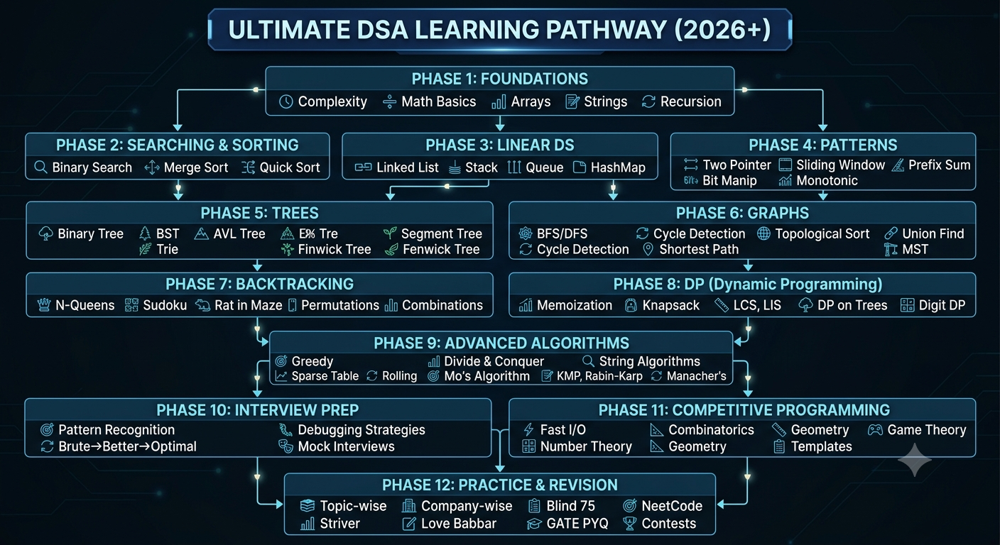

# Data Structures and Algorithms Roadmap



This roadmap is designed for coding interviews, competitive programming, GATE CSE, software engineering roles, and long-term problem-solving mastery.

Use it as a visual curriculum map, a revision guide, and a topic checklist for interview and contest preparation.

## Roadmap At A Glance

| Phase | Focus | Outcome |
| --- | --- | --- |
| Phase 1 | Foundations | Build complexity awareness and problem-solving basics |
| Phase 2 | Searching and Sorting | Learn core ordering and lookup techniques |
| Phase 3 | Linear Data Structures | Master lists, stacks, queues, and hashing |
| Phase 4 | Problem-Solving Patterns | Recognize reusable techniques for faster solutions |
| Phase 5 | Trees | Handle hierarchical data and tree-based optimizations |
| Phase 6 | Graphs | Model and solve network and dependency problems |
| Phase 7 | Recursion and Backtracking | Explore exhaustive search in a controlled way |
| Phase 8 | Dynamic Programming | Solve optimization and counting problems systematically |
| Phase 9 | Advanced Algorithms | Strengthen high-level contest and interview tools |
| Phase 10 | Interview Preparation | Turn knowledge into clear, optimal solutions |
| Phase 11 | Competitive Programming | Build speed, precision, and template-driven execution |
| Phase 12 | Practice and Revision | Consolidate knowledge with curated problem sets |

## How To Use This Roadmap

- Follow the phases in order because each one builds on the previous phase
- Solve problems immediately after learning a topic
- Keep a mistake log and revisit it regularly
- Focus on reasoning first, then on implementation speed
- Use the pattern sections to reduce repeated thinking during interviews and contests

---

## Phase 1: Foundations

### Learning Objectives

- Understand how algorithmic complexity guides solution choice
- Build comfort with arrays, strings, matrices, and recursion basics
- Learn how to analyze code before optimizing it

### Topics Covered

- Time complexity
- Space complexity
- Asymptotic analysis
- Big O
- Big Omega
- Big Theta
- Best, average, and worst case analysis
- Mathematical fundamentals
- Summations and series basics
- Logarithms and exponentials
- Recursion basics
- Arrays
- Strings
- Matrix problems
- Basic iteration and traversal

### Prerequisites

- Basic programming syntax
- Variables, conditionals, loops, and functions

### Recommended Practice

- Count operations for small code snippets
- Solve array traversal and string manipulation exercises
- Solve matrix traversal, spiral, and boundary problems
- Trace small recursive functions by hand

### Common Mistakes

- Ignoring complexity and relying on intuition alone
- Confusing Big O with exact runtime
- Missing off-by-one issues in matrix traversal
- Writing recursion without a clear base case
- Recomputing values that can be tracked iteratively

### Interview-Relevant Concepts

- Complexity analysis
- Recursion traceability
- Array and string traversal
- Matrix indexing
- Problem decomposition

### Frequently Asked Questions

- What is the difference between Big O, Big Omega, and Big Theta?
- Why is space complexity important?
- When should recursion be avoided?
- Why are arrays considered contiguous structures?

---

## Phase 2: Searching and Sorting

### Learning Objectives

- Learn how data ordering improves lookup and processing
- Understand stable and unstable sorting
- Choose the right searching technique for a given problem

### Topics Covered

- Linear search
- Binary search
- Searching techniques
- Bubble sort
- Selection sort
- Insertion sort
- Merge sort
- Quick sort
- Heap sort
- Counting sort
- Radix sort
- Bucket sort
- Stable vs unstable sorting
- Lower bound and upper bound ideas
- Search on sorted arrays

### Prerequisites

- Phase 1 fundamentals
- Basic recursion for merge sort and quick sort understanding

### Recommended Practice

- Implement all standard sorting algorithms
- Solve binary search on arrays and answer-space problems
- Compare stable and unstable behavior on duplicate values
- Practice first/last occurrence and insertion position problems

### Common Mistakes

- Using binary search on unsorted data
- Forgetting duplicate-handling logic
- Misplacing pivot logic in quick sort
- Confusing in-place and out-of-place algorithms
- Ignoring stability requirements in interview questions

### Interview-Relevant Concepts

- Time complexity of each sorting algorithm
- Binary search invariants
- Stable sort behavior
- Divide and conquer thinking

### Frequently Asked Questions

- Why is binary search faster than linear search?
- When is merge sort preferred over quick sort?
- Which sorts are stable?
- Why is insertion sort efficient on nearly sorted arrays?

---

## Phase 3: Linear Data Structures

### Learning Objectives

- Understand sequential and linked storage models
- Learn how stacks, queues, and hashing solve different classes of problems

### Topics Covered

- Linked list
- Singly linked list
- Doubly linked list
- Circular linked list
- Stack
- Queue
- Circular queue
- Deque
- Priority queue
- Hashing
- Hash table
- Collision resolution
- Chaining
- Open addressing
- Load factor
- Rehashing

### Prerequisites

- Pointer basics and memory understanding
- Array operations
- Complexity basics

### Recommended Practice

- Reverse linked lists
- Detect cycles in linked lists
- Implement stack and queue operations
- Solve next greater element and balanced parentheses problems
- Practice frequency counting with hash maps

### Common Mistakes

- Losing track of pointers in linked list manipulation
- Forgetting edge cases for empty and single-node lists
- Misusing stack and queue semantics
- Ignoring collision behavior in hash tables
- Treating priority queues like sorted arrays

### Interview-Relevant Concepts

- Pointer manipulation
- Head insertion and deletion
- Queue and stack use cases
- Hash map time complexity
- Collision resolution strategies

### Frequently Asked Questions

- Why are linked lists useful if arrays are simpler?
- What is the difference between a stack and a queue?
- How does a hash table handle collisions?
- When should you use a deque?

---

## Phase 4: Problem-Solving Patterns

### Learning Objectives

- Recognize repeated solution templates
- Reduce brute-force thinking with reusable patterns
- Improve speed in interviews and contests

### Topics Covered

- Two pointers
- Sliding window
- Prefix sum
- Difference array
- Binary search on answer
- Greedy basics
- Bit manipulation
- Fast and slow pointer
- Monotonic stack
- Monotonic queue

### Prerequisites

- Arrays, strings, and hashing
- Sorting and binary search
- Basic complexity analysis

### Recommended Practice

- Solve standard pattern problems for each technique
- Practice pattern recognition from problem statements
- Re-solve the same problem with a better pattern

### Common Mistakes

- Using brute force where a pattern fits naturally
- Forgetting window shrink conditions
- Misapplying greedy reasoning without proof
- Handling bits incorrectly for edge cases
- Confusing monotonic stack with standard stack usage

### Interview-Relevant Concepts

- Pattern recognition
- Optimization from O(n^2) to O(n)
- Invariant maintenance
- Proof of correctness for greedy choices

### Frequently Asked Questions

- When should two pointers be used?
- How do you know sliding window applies?
- What makes a greedy solution valid?
- Why are monotonic stacks useful?

---

## Phase 5: Trees

### Learning Objectives

- Work with hierarchical and ordered structures
- Learn tree traversals, balancing, and advanced tree-based queries

### Topics Covered

- Binary tree
- Tree traversals
- Preorder, inorder, postorder
- Level order traversal
- Binary search tree
- AVL tree
- Heap
- Trie
- Segment tree
- Fenwick tree
- Lowest common ancestor
- Binary lifting
- Tree diameter
- Tree height and depth
- Euler tour basics

### Prerequisites

- Recursion
- Pointers and references
- Queue and stack concepts

### Recommended Practice

- Build and traverse binary trees
- Solve BST validation and insertion/deletion problems
- Practice heap-based selection problems
- Solve trie prefix queries
- Practice range query problems with segment tree and Fenwick tree

### Common Mistakes

- Mixing up traversal orders
- Forgetting null-child base cases
- Incorrectly balancing tree invariants
- Misusing heap ordering
- Confusing segment tree node ranges

### Interview-Relevant Concepts

- Recursive tree traversal
- BST properties
- Balanced trees
- Range query structures
- Ancestor and path queries

### Frequently Asked Questions

- What is the difference between a tree and a binary tree?
- Why is BST search efficient?
- When do we use a trie?
- Why are segment trees and Fenwick trees useful?

---

## Phase 6: Graphs

### Learning Objectives

- Model relationships and dependencies
- Solve traversal, path, and connectivity problems
- Understand graph algorithms used in interviews and contests

### Topics Covered

- Graph representation
- Adjacency list
- Adjacency matrix
- BFS
- DFS
- Connected components
- Cycle detection
- Topological sort
- Shortest path algorithms
- Dijkstra
- Bellman-Ford
- Floyd-Warshall
- Minimum spanning tree
- Kruskal
- Prim
- Union Find
- Disjoint Set Union
- Strongly connected components
- Bridges
- Articulation points

### Prerequisites

- Trees and recursion
- Queue, stack, and hashing
- Sorting and greedy basics

### Recommended Practice

- Traverse graphs using BFS and DFS
- Detect cycles in directed and undirected graphs
- Solve shortest path and connectivity problems
- Practice MST and DSU problems
- Solve SCC and bridge/articulation problems on harder sets

### Common Mistakes

- Misrepresenting graph edges
- Forgetting visited-state management
- Applying BFS where weighted shortest path is needed
- Confusing directed and undirected graph logic
- Ignoring disconnected components

### Interview-Relevant Concepts

- Graph traversal
- Connectivity
- Cycle detection
- Shortest path reasoning
- Union find optimization

### Frequently Asked Questions

- When should BFS be used instead of DFS?
- Why is Dijkstra not suitable for negative weights?
- What is the purpose of DSU?
- How do bridges and articulation points help in network analysis?

---

## Phase 7: Recursion and Backtracking

### Learning Objectives

- Solve exhaustive search problems systematically
- Understand pruning and state restoration
- Strengthen tree and search thinking

### Topics Covered

- Recursive problem solving
- Backtracking
- N-Queens
- Sudoku solver
- Permutations
- Combinations
- Subsets
- State space trees
- Branch pruning

### Prerequisites

- Recursion basics
- Arrays and strings
- Tree-like thinking

### Recommended Practice

- Generate all subsets and permutations
- Solve classic constraint problems
- Practice backtracking with pruning
- Draw recursion trees for small inputs

### Common Mistakes

- Forgetting to undo state changes
- Missing pruning opportunities
- Using recursion without clear state definition
- Confusing permutation and combination logic

### Interview-Relevant Concepts

- State, choice, and constraint formulation
- Search space pruning
- Recursion tree visualization

### Frequently Asked Questions

- What is backtracking?
- How is it different from plain recursion?
- Why does pruning improve performance?

---

## Phase 8: Dynamic Programming

### Learning Objectives

- Recognize overlapping subproblems and optimal substructure
- Convert recursive ideas into efficient DP solutions
- Handle counting, optimization, and decision problems

### Topics Covered

- DP fundamentals
- Memoization
- Tabulation
- 1D DP
- 2D DP
- Knapsack problems
- Longest common subsequence
- Longest increasing subsequence
- Matrix chain multiplication
- DP on trees
- Bitmask DP
- Digit DP
- Partition DP
- Interval DP

### Prerequisites

- Recursion and backtracking
- Arrays, strings, and trees
- Problem decomposition and complexity analysis

### Recommended Practice

- Solve classic memoization-to-tabulation conversions
- Practice knapsack, LIS, and LCS variants
- Trace transitions on paper before coding
- Build a DP state definition habit

### Common Mistakes

- Defining the wrong state
- Incorrect transition logic
- Forgetting base cases
- Mixing memoization and tabulation ideas inconsistently
- Overcomplicating state dimensions

### Interview-Relevant Concepts

- State definition
- Transition formulation
- Base case identification
- Space optimization
- DP classification patterns

### Frequently Asked Questions

- How do you identify a DP problem?
- What is the difference between memoization and tabulation?
- Why is LIS harder than simple subsequence problems?
- When is bitmask DP useful?

---

## Phase 9: Advanced Algorithms

### Learning Objectives

- Learn advanced methods used in harder interviews and contests
- Expand beyond standard textbook patterns
- Improve optimization and string-processing capability

### Topics Covered

- Greedy algorithms
- Divide and conquer
- Meet in the middle
- Sweep line
- Sparse table
- Mo's algorithm
- KMP algorithm
- Rabin-Karp
- Z algorithm
- Manacher's algorithm
- Rolling hash
- Advanced query optimization

### Prerequisites

- Sorting
- Prefix sums
- Recursion
- Hashing
- Dynamic programming basics

### Recommended Practice

- Solve classical string matching problems
- Practice offline query problems
- Work on range query and preprocessing problems
- Compare multiple approaches on the same problem

### Common Mistakes

- Using advanced algorithms without knowing the baseline
- Mistaking heuristic greedy choices for proofs
- Misapplying rolling hash without collision awareness
- Ignoring preprocessing tradeoffs

### Interview-Relevant Concepts

- Greedy proof patterns
- String matching
- Range queries
- Precomputation strategies

### Frequently Asked Questions

- When does divide and conquer help?
- Why use KMP instead of brute-force matching?
- What is the purpose of a sparse table?

---

## Phase 10: Interview Preparation

### Learning Objectives

- Turn knowledge into clear, optimal interview solutions
- Explain approach, complexity, and tradeoffs confidently
- Handle follow-up questions and edge cases

### Topics Covered

- Problem-solving strategy
- Pattern recognition
- Brute force to better to optimal progression
- Dry run techniques
- Complexity analysis
- Edge case identification
- Code optimization
- Mock interviews
- Communication of approach

### Prerequisites

- All core data structure and algorithm phases

### Recommended Practice

- Solve timed problems and explain aloud
- Practice writing solution outlines before code
- Review failed attempts and rewrite them cleanly

### Common Mistakes

- Jumping into coding too early
- Ignoring edge cases
- Poorly explaining the solution path
- Not validating complexity claims

### Interview-Relevant Concepts

- Problem framing
- Complexity justification
- Communication under pressure
- Iterative improvement of solutions

### Frequently Asked Questions

- How do you decide between brute force and optimization?
- How do you dry run a solution correctly?
- How do you explain time and space complexity in interviews?

---

## Phase 11: Competitive Programming

### Learning Objectives

- Write fast, correct, and reusable code under time pressure
- Learn contest-oriented math and implementation techniques
- Build a standard template for speed

### Topics Covered

- Fast input/output
- Modular arithmetic
- Number theory
- Prime algorithms
- Combinatorics
- Geometry basics
- Game theory basics
- Standard competitive programming templates
- Debugging under time pressure
- Handling multiple test cases

### Prerequisites

- Strong implementation fluency
- Arrays, sorting, graphs, DP, and hashing

### Recommended Practice

- Solve contest archives
- Practice implementation-heavy and math-heavy problems
- Build and reuse templates
- Simulate contest environments regularly

### Common Mistakes

- Slow I/O in large tests
- Forgetting modulo rules
- Writing untested template code
- Misreading problem constraints

### Interview-Relevant Concepts

- Fast implementation
- Modular thinking
- Correctness under pressure
- Template reuse

### Frequently Asked Questions

- What is modular inverse?
- When should fast I/O be used?
- Why is precomputation useful in contests?

---

## Phase 12: Practice and Revision

### Learning Objectives

- Consolidate knowledge with repeated exposure
- Cover interview-style and contest-style problem mixes
- Maintain long-term retention

### Topics Covered

- Topic-wise problems
- Mixed revision sets
- Company-wise questions
- Blind 75
- NeetCode 150
- Striver A2Z DSA Sheet
- Love Babbar DSA Sheet
- GATE PYQs
- Contest practice
- Mistake log revision

### Prerequisites

- Completed study of the core roadmap

### Recommended Practice

- Revisit weaker topics weekly through mixed sets
- Solve old mistakes again without notes
- Do topic-specific drills and full mixed mocks
- Keep a concise revision notebook

### Common Mistakes

- Only solving new questions
- Ignoring revision
- Overfocusing on one topic while neglecting others
- Not tracking recurring mistakes

### Interview-Relevant Concepts

- Speed and accuracy
- Pattern recall
- Problem selection
- Confidence building

### Frequently Asked Questions

- How do I choose revision questions?
- How do I balance breadth and depth?
- How do I know I am interview-ready?

---

## Visual Learning Flow

```text
Foundations
    |
    v
Searching & Sorting
    |
    v
Linear Data Structures
    |
    v
Problem-Solving Patterns
    |
    v
Trees
    |
    v
Graphs
    |
    v
Recursion & Backtracking
    |
    v
Dynamic Programming
    |
    v
Advanced Algorithms
    |
    v
Interview Preparation
    |
    v
Competitive Programming
    |
    v
Practice & Revision
```

## Dependency Graph

```text
Phase 1 -> Phase 2 -> Phase 3 -> Phase 4 -> Phase 5 -> Phase 6 -> Phase 7 -> Phase 8 -> Phase 9 -> Phase 10 -> Phase 11 -> Phase 12

Foundations support every later phase.
Linear structures depend on arrays, pointers, and complexity.
Trees and graphs depend heavily on recursion, queues, stacks, and hashing.
Backtracking and DP depend on recursion and problem decomposition.
Advanced algorithms depend on sorting, prefix ideas, hashing, and DP basics.
Interview preparation and contest readiness depend on all earlier phases.
```

## Complete DSA Checklist

- [ ] Time and space complexity
- [ ] Arrays
- [ ] Strings
- [ ] Matrices
- [ ] Linear search
- [ ] Binary search
- [ ] Sorting algorithms
- [ ] Linked lists
- [ ] Stack
- [ ] Queue
- [ ] Deque
- [ ] Priority queue
- [ ] Hash map and hash set
- [ ] Two pointers
- [ ] Sliding window
- [ ] Prefix sum
- [ ] Difference array
- [ ] Binary search on answer
- [ ] Greedy basics
- [ ] Bit manipulation
- [ ] Monotonic stack and queue
- [ ] Binary tree traversals
- [ ] BST
- [ ] AVL tree
- [ ] Heap
- [ ] Trie
- [ ] Segment tree
- [ ] Fenwick tree
- [ ] LCA
- [ ] Binary lifting
- [ ] Graph representation
- [ ] BFS and DFS
- [ ] Connected components
- [ ] Cycle detection
- [ ] Topological sort
- [ ] Shortest paths
- [ ] MST
- [ ] DSU
- [ ] SCC
- [ ] Bridges and articulation points
- [ ] Recursion
- [ ] Backtracking
- [ ] Memoization
- [ ] Tabulation
- [ ] Knapsack
- [ ] LCS
- [ ] LIS
- [ ] DP on trees
- [ ] Bitmask DP
- [ ] Digit DP
- [ ] Divide and conquer
- [ ] Meet in the middle
- [ ] Sweep line
- [ ] Sparse table
- [ ] KMP
- [ ] Rabin-Karp
- [ ] Z algorithm
- [ ] Manacher's algorithm
- [ ] Rolling hash
- [ ] Modular arithmetic
- [ ] Number theory
- [ ] Combinatorics
- [ ] Geometry basics
- [ ] Game theory basics

## Revision Roadmap

### Revision Layer 1

- Revise formulas, definitions, and invariants
- Re-read mistake logs
- Re-solve easy and medium problems

### Revision Layer 2

- Rebuild templates for arrays, strings, trees, graphs, and DP
- Re-implement common algorithms from memory
- Time yourself on standard problems

### Revision Layer 3

- Mix topics in mock sets
- Review problem patterns and their triggers
- Practice explaining solutions out loud

### Revision Layer 4

- Revisit weak topics before interviews
- Refresh contest templates
- Rehearse edge cases and complexity reasoning

## Recommended Books

- `Introduction to Algorithms` by Cormen, Leiserson, Rivest, and Stein
- `Competitive Programming` by Steven Halim and Felix Halim
- `Data Structures and Algorithms Made Easy` by Narasimha Karumanchi
- `Algorithm Design Manual` by Steven Skiena
- `The Art of Computer Programming` by Donald Knuth
- `Programming Challenges` by Steven Skiena and Miguel Revilla

## Recommended Documentation

- cp-algorithms: https://cp-algorithms.com/
- GeeksforGeeks DSA reference: https://www.geeksforgeeks.org/data-structures/
- CSES Problem Set: https://cses.fi/problemset/
- VisuAlgo: https://visualgo.net/
- USACO Guide: https://usaco.guide/

## Recommended YouTube Channels

- Tushar Roy
- Take U Forward
- Abdul Bari
- Striver
- William Fiset
- Errichto
- CodeNCode
- Algorithms Made Easy

## Recommended Practice Platforms

- LeetCode
- Codeforces
- AtCoder
- CSES Problem Set
- HackerRank
- GeeksforGeeks
- SPOJ
- InterviewBit
- CodeChef
- TopCoder

## Most Frequently Asked Interview Topics

- Arrays and strings
- Linked lists
- Stacks and queues
- Hash maps
- Binary search
- Two pointers and sliding window
- Trees and BST
- Recursion and backtracking
- Graph BFS and DFS
- Shortest paths
- Dynamic programming
- Greedy
- Heaps and priority queues
- Union find
- Sorting
- Complexity analysis

## Common Problem-Solving Patterns And When To Use Them

- Two pointers: when the array or string is sorted or when two indices can shrink or expand toward each other
- Sliding window: when a contiguous subarray or substring property must be maintained efficiently
- Prefix sum: when repeated range sum queries or cumulative values are needed
- Difference array: when many range updates are followed by a final reconstruction
- Binary search on answer: when the solution space is monotonic
- Greedy: when a local choice can be proven to lead to a global optimum
- Fast and slow pointer: when cycle detection or middle finding is needed
- Monotonic stack: when next greater, previous smaller, or span-style relations are needed
- Monotonic queue: when maintaining min or max over a sliding window
- DFS/BFS: when exploring connected states, graphs, trees, or grids
- DSU: when dynamic connectivity or component merging is needed
- Memoization: when a recursive solution has overlapping subproblems
- Tabulation: when bottom-up state filling is simpler or more efficient
- Meet in the middle: when exponential search space can be split into two manageable halves
- Divide and conquer: when a problem can be split into independent subproblems
- Sweep line: when event ordering over a line or time axis matters

## Capstone Roadmap

### Beginner Track

- Array and string toolkit
- Simple calculator with history
- Pattern printing and number utility suite
- Basic file-based note manager

### Intermediate Track

- Library management system
- Student performance analyzer
- Contact manager with searching and sorting
- Expense tracker with persistence

### Advanced Track

- Competitive programming helper toolkit
- Graph and tree query visualizer
- Task scheduler with dependency handling
- Mini judge for algorithm practice

### Capstone Steps

- Pick one domain and define the core workflow
- Map required data structures and algorithms
- Implement the smallest usable version first
- Add search, sort, analytics, or graph-style features
- Optimize hot paths and clean up edge cases
- Add tests and sample inputs
- Document design decisions and limitations

### Capstone Output

- Clean repository structure
- Readme with problem statement and usage
- Modular source files
- Test cases and sample outputs
- Short design notes explaining algorithm choices
